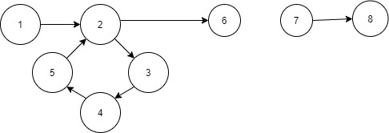
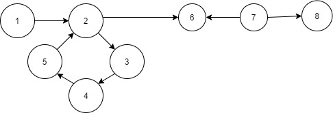

- ## PREREQUISITE : DFS , Topsort , Strongly Connected Components
- ### EXPLANATION :

 - #### Graph 1 
    
 
 In this figure you can see the graph is disconnected so it is not possible to visit all the edges of the Graph in one single path .
 So First We need to ensure that the Graph is Connected .
 
 
 
 - #### Graph 2 
   
 
 In this Figure you can see that the graph is connected but The vertex 7 has no indegree so it is not possible to visit edge vertex 7-->8 and  7-->6 in one single Path .
 So secondly we need to ensure this that No vertex in the graph has zero indegree Except the starting Node . Starting Node's Indegree can be 0 or 1 . But other than starting Node no other node should have zero indegree .
 
 - #### Graph 3 
    
 
 In this Figure , You can see whatever path you take either 2--> 6 or 5--> 6 will remain unvisited . If the Graph Follows above two condition then we will make a SCC graph from
 the Given Graph . Then we will check whether there is any Strongly Connected Component which has >= 2 outdegree . IF it is so then it is not possible to visite all the edges .
 
- #### Graph 4 
   
 
 Finally this graph follows all the condition . The graph is connected , Other than Starting Node no other Node has zero indegree ( The starting Node could have one indegree that is not an issue ) , All othe SCC's of the Graph have Outdegree < 2 .
 
 So we need ensure 4 thing 
 1. First We need to check whether the Graph is connected or Not and if there is any Node which has zero indegree other than starting Node . We can check this Using Topsort .
 2. Then we will make a SCC graph . That means we will consider every SCC of the Graph as a node and then Construct a Graph .
 3 . Now we will check if there is any SCC which has outdegree >= 2 . 
 

 
