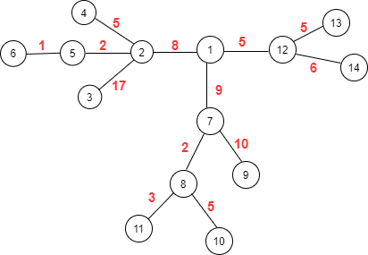

- ## PREREQUISITE : DFS , FINDING FURTHEST DISTANCE BETWEEN ANY TWO NODES IN THE TREE , FINDING DIAMETER OF A TREE 

- ### EXPLANATION :

In the above Graph, if you pick any random Node **X** in the Graph then the Maximum distance from that node will be either to Node 3 or Node 9. From Node 3 maximum distance will be 
to Node 9 and that is why From node 9 maximum distance will be to Node 3. 

So basically For node **X** we don't need to know the distance from node **X** to other nodes Except Node 3 and  Node 9. We just need to know the maximum distance between the Node
**X** to node 3 and node **X** to node 9 . The maximum of these two distances will be our desired result.

Now What attribute does Node 3 or Node 9 resembles ???  Node 3 and Node 9 are two Furthest Nodes in the Graph. That means The distance between these two nodes is maximum
in the Graph That's Why for any Node in the Graph the maximum distance will be either to Node 3 or Node 9.

 So , For a Similar Situation In any tree what we need to do is,
 First We can Pick any random Node and Run a DFS from That node and find the Furthest Node from that Random Node. It will be our First Furthest Node or You can say One part of the Longest Chain. Then we will Run Another DFS from First Furthest Node and in the Similar Way we will find our Second Furthest Node or another part of a Chain. So after this second DFS function, we will be able to know the distance from our First Furthest Node to Any other Node in the Graph. But we also need to Know the Distance from Second Furthest Node to All other Node. That's Why we run another DFS function from our Second Furthest Node. 
 Now, The final Step for Every Node We will check which distance is maximum ?? Distance to FIrst Furhtest Node or distance to Second Furthest Node.
