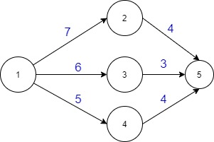

- ## PREREQUISITE : DIjkstra
- ### QUESTION EXPLANATION :
  A directed weighted Graph ,it's source and destination vertex is given . There is also a Weight limit L . Now we need to find a route such that some of all the weights in the 
  path is <= L . There can be several possible path under these conditions . But we need to pick such a path which contains highest weight edge . Let us give a example ,   
  
    
  For the given picture, s = 1, t = 5 and L = 10. There are three paths from 1 to 5.  
  1.  Path 1: 1 - 2 - 5, total weight edge = 11 (> L)  
  2.  Path 2: 1 - 3 - 5, total weight edge = 9 (≤ L), 6 is the maximum weight edge  
  3.  Path 3: 1 - 4 - 5, total weight edge = 9 (≤ L), 5 is the maximum weight edge   
  So the maximum weight edge for a road of all of the paths having total weight edge not greater than L is 6.
- ### Explanation :
  Our goal is to find such edge that the weight is maximum and it belongs to such a path that the sum of all the weights in a path is <= L . So for this , we will check every 
  edge in the graph . A edge Connectes two nodes . From one node the edge comes out we will call this **Outgoing node** and it goes to another node which we will call **Incoming    node** . Now we need to find the shortest path from Source to Outgoing node and the shortest path from destination to Incoming node . Because we also need to ensure that sum of the weight in a path should be <= L . Now we will check Which edge is valid under the condition and then we will print the Highest Edge which is valid . So, it is crystal clear that , we need to run Dijkstra twice . One is to find the shortest path from source to Outgoing nodes . So for this , Our First Dijkstra Function will have Source as the starting
  vertex and it will run in general graph . Second Dijkstra is to find the shortest path from destination to Incoming nodes . For this , it will have Destination as the starting vertex and it will run in reverse graph .
